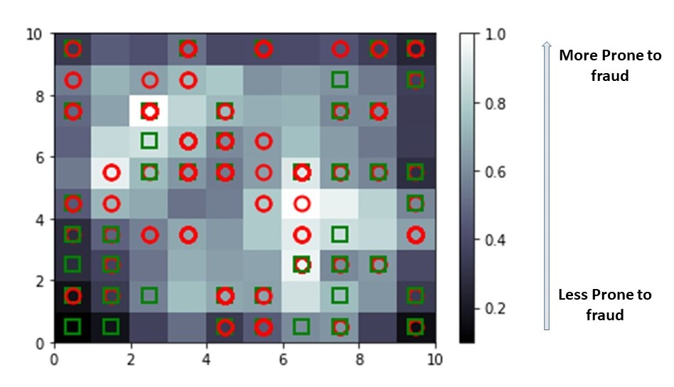

# Self_Organizing_Maps
A self-organizing map (SOM) is a type of artificial neural network (ANN) that is trained using unsupervised learning to produce a low-dimensional (typically two-dimensional), 
discretized representation of the input space of the training samples, called a map, and is therefore a method to do dimensionality reduction. Self-organizing maps differ from 
other artificial neural networks as they apply competitive learning as opposed to error-correction learning (such as backpropagation with gradient descent), and in the sense 
that they use a neighborhood function to preserve the topological properties of the input space. 

### Fraud detection using SOM based on the application form

 

### Important to know:
1. SOMs retain topology of the imput set
2. SOMs reveal correlations that are not easily identified
3. SOMs classify data without supervision
4. No targte vector means no back propagation
5. No lateral connections between outputs nodes

